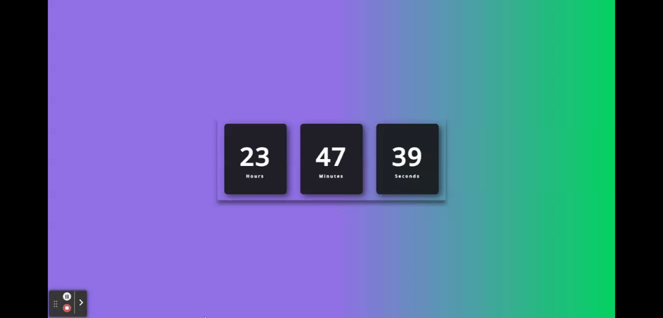

<div align="center" id="top"> 
  

&#xa0;

<a href="https://jose-bone.github.io/digital-clock/">Demo</a>

</div>

<h1 align="center">Digital Clock</h1>

<p align="center">
  

  

  

  

  

  

  
</p>

Status

<h4 align="center">
	🚧  Digital Clock 🚀 Under construction...  🚧
</h4>

<hr>

<p align="center">
  <a href="#dart-about">About</a> &#xa0; | &#xa0; 
  <a href="#rocket-technologies">Technologies</a> &#xa0; | &#xa0;
  <a href="#white_check_mark-requirements">Requirements</a> &#xa0; | &#xa0;
  <a href="#checkered_flag-starting">Starting</a> &#xa0; | &#xa0;
  <a href="#memo-license">License</a> &#xa0; | &#xa0;
  <a href="https://github.com/jose-bone" target="_blank">Author</a>
</p>

<br>

## :dart: About

A digital clock created with HTML, CSS and JS

## :rocket: Technologies

The following technologies were used in this project:

- [HTML](https://developer.mozilla.org/en-US/docs/Learn/HTML)
- [CSS](https://developer.mozilla.org/en-US/docs/Learn/CSS)
- [JavaScript](https://developer.mozilla.org/en-US/docs/Learn/JavaScript)

## :white_check_mark: Requirements

Before starting :checkered_flag:, you need to have [Git](https://git-scm.com) and [VSCode](https://code.visualstudio.com) installed.

## :checkered_flag: Starting

```bash
# Clone this project
$ git clone https://github.com/jose-bone/digital-clock.git

# Access
$ cd digital-clock/
```

## :memo: License

This project is under license from MIT. For more details, see the [LICENSE](LICENSE.md) file.

Made with 💜 by <a href="https://github.com/jose-bone" target="_blank">José Boné</a>

&#xa0;

<a href="#top">Back to top</a>
